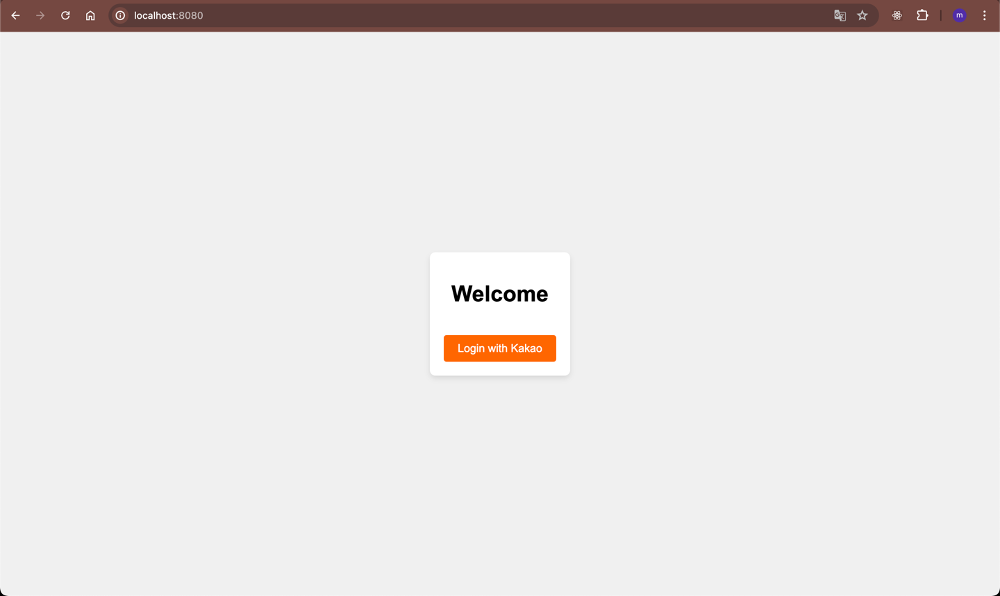
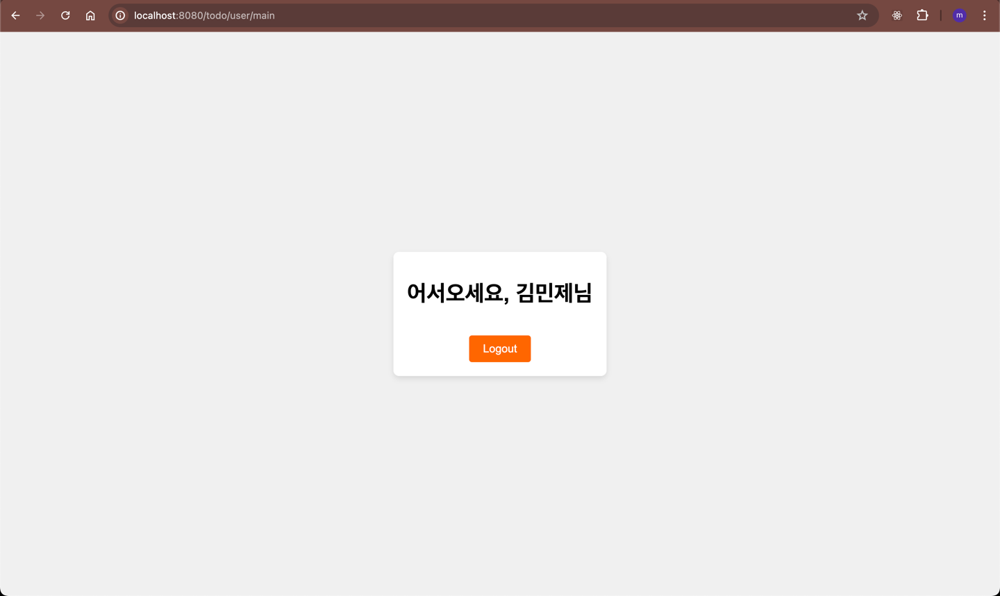
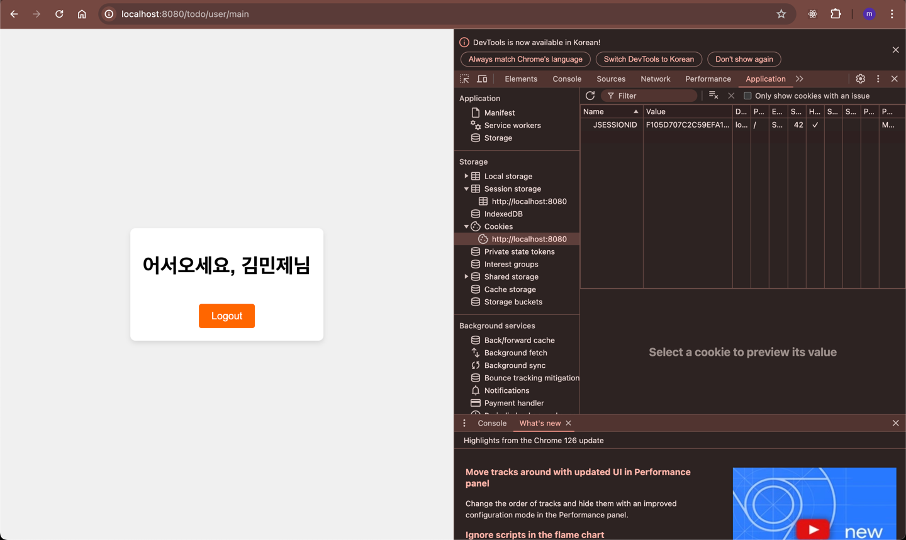
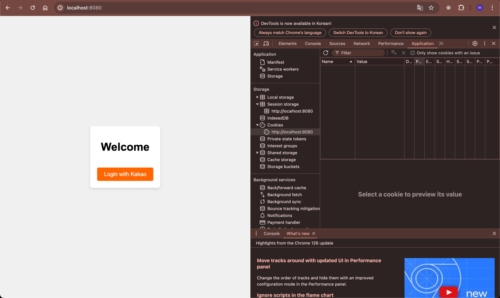

# REL.TODO
개인 미션들을 활용한 TODO 애플리케이션입니다.
## 사용 개인 미션 목록
카카오 API를 활용하여 사용자 로그인 기능을 구현

## 사용 방법
### 카카오 API를 활용하여 사용자 로그인 기능을 구현
1. 홈페이지 접속

2. 로그인 수행

이름 부분에는 OAuth2에서 가져온 Nickname 사용

쿠키에 JSESSIONID 저장
3. 로그아웃

main 화면으로 리다이렉션